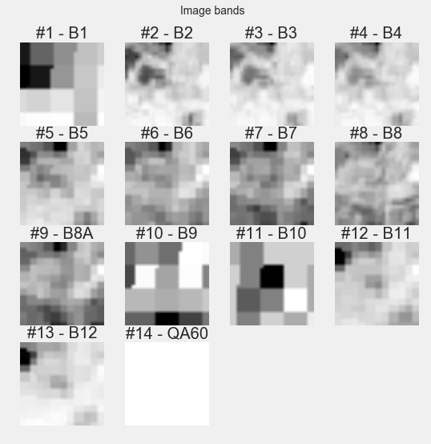
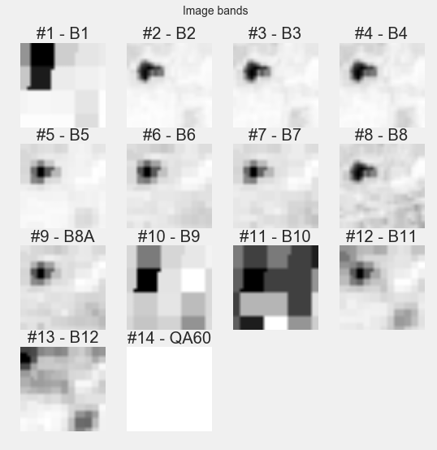

# Leak detection

UPDATE 2025-03-20

Since a few people have asked me about this, and I haven't had time to respond, here's a general update:

My retrospective is this: we found that the method of detecting water leaks from satellite heat images seems to work for large leaks in hot countries. I would be skeptical that it would work in cold and wet countries as the heat contrast may not be there. You also need to distinguish it from irrigation, for example if irrigation always occurs at 6am, but satellites fly over at 7am, you will pick up surface water. We used low resolution satellite images in our experiments (meters per pixel), so it may well work on smaller leaks if you use high resolution satellite or drone images, but this can get more expensive to test. We did find there was some appetite from water companies to try this out, especially if they were experimenting with drones or aerial imagery already.

**DRAFT 2017-05-01**

*Michael Clark (michael.clark via wassname dot org), Craig Baldacchino*

This project explores the idea that we can find leaks using satellite images and machine learning. The primary hypothesis is that given the time and place of leak repairs and given satellite images of 10-15m2 resolution we can predict leaks better than a baseline defined by random guessing. We use a random forest model then we tweak the data filters and model parameters using hyper-optimization. Our results give an f1-score of around 0.6 compared to a dummy f1-score of 0.5. This small improvement supports our hypothesis but it represents a predictive capability is too poor to be used for pipe maintenance. We anticipate that repeating the experiment with higher resolution imagery may give useful levels of predictive capability.

# Introduction

Water leakage in Western Australia accounts for more than 10 billion liters of water and costs over a billion dollars each year. The Water Corporation of Western Australia can only manually survey 10-12 percent of the pipe network each year for non-visible leaks [[1]](#wc2015). A solution that can detect leaks without additional on-site inspections would be valuable for water utilities around the world.

One such solution is to use satellite images to detect leaks. Satellite derived vegetation indices can be used for the detection of water pipeline leakages in semiarid areas [[2]](#2). Spectral signature profiles can also be used to detect leaks but the signatures can be complicated [[3]](#3).

Deep learning has been successful at detecting objects from satellite images even when the images give complicated response profiles [[4]](#4). This project attempts to find leaks using satellite images by utilizing machine learning to overcome difficulties with complex data.

# Data

We have a dataset of leak repairs which was obtained by a freedom of information requests to the very helpful people at Austin Water. The dataset includes the time of repair and the location which is accurate to within one street address. The data includes some obvious false call outs, duplicates, and multi-stage repairs but these are a minority and should only decrease our accuracy by a few percent.

Leaks locations have been combined with satellite images taken before or after a leak repair. Images *t* days before a leak were classified as positive examples of leaks – where t is a parameter determined by experimentation to be 1.5 days (See the appendix). Images after a leak are classified as negative examples. Images were downloaded from Google Earth Engine but many satellites only pass over once a week so not every leak has corresponding images. For more see [the scraping notebooks](notebooks/scraped_satellite_images) and the readme files for each dataset. An example of this data is below:

*An example of a sentinel-2 image 1 day before a leak repair near 608 Morrow St, Austin TX*

*An example of a sentinel-2 image 100 days after a leak repair near 608 Morrow St, Austin TX*

| dataset                     |  Satellite   |  Leak dataset  |  Resolution *  |
|-----------------------------|--------------|----------------|-----------------|
| s1-AURX_COPERNICUS-S1_GRD   |  [Sentinel 1](https://explorer.earthengine.google.com/#detail/COPERNICUS%2FS1_GRD)  |  ATX           |  >10m2          |
| s2-AUTX_v6_COPERNICUS-S2    |  [Sentinel 2](https://explorer.earthengine.google.com/#detail/COPERNICUS%2FS2)  |  ATX           |  >10m2          |
| l7-AUTX_v2_LANDSAT-LE7_L1T  |  [Landsat 7](https://explorer.earthengine.google.com/#detail/LANDSAT%2FLE7_L1T)   |  ATX           |  >15m2          |
| l8-AUTX_v2_LANDSAT-LC8_L1T  |  [Landsat 8](https://explorer.earthengine.google.com/#detail/LANDSAT%2FLC8_L1T)   |  ATX           |  >15m2          |

\*	This gives source resolution. All data was interpolated

*A list of datasets and resolutions*

After combining the datasets we must consider filtering the data. We might filter out cloudy images or images that to many days before a leak repair. For example a leak might be repaired two days after it's first observed, making an images three days before a poor example of a leak.

Which data filters yield the best results? To answer this question we used hyper-parameter optimization to find the data filters that have the most predictive power for each dataset. For more see the [hyperopt notebook](notebooks/3a_hyperopt.ipynb) and the data tables in the appendix.

# Models

Modeling and prediction is done in the [3_model notebook](notebooks/3_model.ipynb) where outputs include a map of false positives, predictions, and metrics. We tried many models and architectures including U-Net [[5]](#unet), pre-trained VGG-16 [[6]](#vgg16), decision-tree regressers, and multi-layer perceptrons. No model gave any significant improvement over random forest methods so this was our primary model.

# Results

We tested 500 random forest models on each of our satellite datasets then took the mean of the best 50 models. Dummy scores were generated by scikit's dummy classifiers with a uniform strategy. Since we used balanced data we can use f1-scores as our primary benchmark. If the models max score doesn't exceed the dummy score then it's a dataset with lots of misleading features. If the max score does exceed the dummy score then it may be an example of a small sample size or it may be an improvement over random guessing. The table below shows the results, for more see the [2_qc_scraped_data notebook](notebooks/2_qc_scraped_data.ipynb).

|                             |   support |   dummy f1-score-score |   f1-score_leak_max |   f1-score_leak_mean |
|:----------------------------|----------:|----------------:|--------------:|---------------:|
| s1-AUTX_COPERNICUS-S1_GRD   |       281 |            0.58 |          0.68 |          0.511 |
| s2-AUTX_COPERNICUS-S2       |       224 |            0.57 |          0.66 |          0.521 |
| l7-AUTX_LANDSAT-LE7_L1T     |      1082 |            0.54 |          0.66 |          0.426 |
| l8-AUTX_LANDSAT-LC8_L1T     |       434 |            0.55 |          0.69 |          0.55  |

*Results of the top 50 random forest models compared to dummy scores for each dataset.*

Our results show that random forest can improve on dummy benchmarks. However the difference is small, and the f1-scores are low, implying many false positives.

# Conclusion

The results support our hypothesis, that machine learning can use satellite images (of 10m2 resolution) to predict water leaks. However the f1-scores indicate that the predictions that are too unreliable to be used in the field.

 The largest limitation in this experiment was the resolution of satellite images. We expect better results with higher resolution images, unfortunately only a limited amount of high resolution imagery is available in 2017. Using the entire Digital Globe catalog would yield around 20 overlaps with our leaks datasets and the same goes for the high resolution US National Agriculture Imagery Program (NAIP). We expect that repeating this experiment when higher resolution imagery is available will yield improved predictions.

# Aknowledgements

Landgate's SPUR team awarded us a grant and supported this project. Thanks to the people at Austin Water who were helpful in releasing the Water Repair data. Thanks to Ali Jeney for her assistance.

# References

<a id="wc2015">1</a>: Water Coporation. 2015. [2015 annual report"](https://www.watercorporation.com.au/-/media/files/about-us/our-performance/annual-report-2015/water-corporation-annual-report-2015.pdf) *Online*.

<a id="2">2</a>: Agapiou, Athos, et al. "Use of satellite derived vegetation indices for the detection of water pipeline leakages in semiarid areas." *First International Conference on Remote Sensing and Geoinformation of Environment. International Society for Optics and Photonics*, 2013.

<a id="3">3</a>: Agapiou, Athos, et al. "Variations of spectral signature profiles of wet and dry targets for supporting the detection of water-leakages using satellite data." *SPIE Remote Sensing. International Society for Optics and Photonics*, 2013.

<a id="4">4</a>: Mnih, Volodymyr, and Geoffrey Hinton. "Learning to detect roads in high-resolution aerial images." *Computer Vision–ECCV* 2010 (2010): 210-223.

<a id="vgg16">5</a>: Ronneberger, Olaf, Philipp Fischer, and Thomas Brox. ["U-net: Convolutional networks for biomedical image segmentation."](http://arxiv.org/abs/1505.04597) *International Conference on Medical Image Computing and Computer-Assisted Intervention*. Springer International Publishing, 2015.

<a id="unet">6</a>: K. Simonyan, A. Zisserman. ["Very Deep Convolutional Networks for Large-Scale Image Recognition."](https://arxiv.org/pdf/1409.1556) *arXiv preprint arXiv:1409.1556*

# Appendix

## Files

The main files are
- `notebooks/0_process_data` where the leak datasets are converted
- `notebooks/scraped_satellite_images` where images are downloaded for each leak
- `notebooks/2_qc_scraped_data.ipynb` where test each dataset for consistency and predictive power
- `notebooks/2a_hyperopt.ipynb` where I try varied filters to see which has the most predictive power
- `notebooks/2_model.ipynb` which is a jupyter-notebook script for python 3.

You can download the raw satellite data used at [this](https://drive.google.com/file/d/16umS6wq6WMXflZp-Irluki7OXYsoxrpQ/view?usp=sharing) link. If the link is dead please email data at wassname followed by org.

## Data filters

We have many options for filtering the data including balancing datasets, jittering value, augumenting data, and filtering out cloudy images. The most important parameter is "timespan_before", here we decide how long we will allow between a satellite image and a leak repair. If we choose to long we will have a image of a pipe before it started leaking, and if we choose to short a time we will reduce our dataset.

To solve this I ran hyperparamater optimisation where I tried all variations using a random forest model. The results are below. The results for Landsat-7 show that the best 50 models used a timespan_before of 1.13 days, before which images are discarded.

### best Landsat-7 filters

top 50 scores,

- by metric="result_metrics_report_f1-score_leak"
- number of trials=564

|                                                 |    corr |    mean |     std | units   |
|:------------------------------------------------|--------:|--------:|--------:|:--------|
| misc_vals_balanced_classes                      |   0.118 |   0.98  |   0.141 | bool    |
| misc_vals_channel_shift_range                   |  -0.137 |   0.083 |   0.06  | frac    |
| misc_vals_height_shift_range                    |  -0.138 |   0.165 |   0.094 | frac    |
| misc_vals_max_cloud_cover                       |  -0.128 |   0.109 |   0.085 | frac    |
| misc_vals_normalized                            | nan     |   0     |   0     | bool    |
| misc_vals_rescale                               |  -0.011 |   0.33  |   0.089 | frac    |
| misc_vals_rotation_range                        |  -0.041 |   9.903 |   7.671 | deg     |
| misc_vals_timespan_before                       |  -0.24  |   1.134 |   1.181 | days    |
| misc_vals_width_shift_range                     |   0.027 |   0.271 |   0.091 | frac    |
| result_metrics_report_f1-score_leak             |   1     |   0.679 |   0.01  |         |
| result_dummy_metrics_report_dummy_f1-score_leak |   0.218 |   0.508 |   0.039 |         |
| result_dummy_metrics_report_dummy_support_leak  |  -0.259 | 217.64  | 207.412 | int     |

Here's an example of how we interpret the table. For the l7 datasets should we used balanced classes? We have a decent positive correlation so it's important. We had a mean of 0.98, but it's bool, so we should set it to True.

If we instead look at `channel_shift_range` we see it has a decent sized negative correlation which means it's important and having it too high gives a low f1 score. The mean is 0.08+-0.06 so lets set it to 0.8.

### Best Landsat-8 filters

top 50 scores,

- by metric="result_metrics_report_f1-score_leak"
- number of trials=564

|                                                 |   corr |    mean |     std | units   |
|:------------------------------------------------|-------:|--------:|--------:|:--------|
| misc_vals_balanced_classes                      |  0.033 |   0.6   |   0.495 | bool    |
| misc_vals_channel_shift_range                   |  0.055 |   0.107 |   0.051 | frac    |
| misc_vals_height_shift_range                    | -0.04  |   0.22  |   0.147 | frac    |
| misc_vals_max_cloud_cover                       | -0.116 |   0.25  |   0.257 | frac    |
| misc_vals_normalized                            | -0.784 |   0.42  |   0.499 | bool    |
| misc_vals_rescale                               |  0.292 |   0.15  |   0.107 | frac    |
| misc_vals_rotation_range                        | -0.072 |  21.022 |   9.381 | deg     |
| misc_vals_timespan_before                       | -0.243 |   5.069 |   1.431 | days    |
| misc_vals_width_shift_range                     |  0.082 |   0.163 |   0.097 | frac    |
| result_metrics_report_f1-score_leak             |  1     |   0.633 |   0.027 |         |
| result_dummy_metrics_report_dummy_f1-score_leak |  0.006 |   0.495 |   0.026 |         |
| result_dummy_metrics_report_dummy_support_leak  | -0.235 | 411.2   | 173.273 | int     |

### Best Sentinel-2 filters

top 50 scores,

- by metric="result_metrics_report_f1-score_leak"
- number of trials=1000

|                                                 |    mean |    std |   corr | units   |
|:------------------------------------------------|--------:|-------:|-------:|:--------|
| misc_vals_balanced_classes                      |   0.98  |  0.141 |  0.027 | bool    |
| misc_vals_channel_shift_range                   |   0.129 |  0.071 | -0.087 | frac    |
| misc_vals_height_shift_range                    |   0.35  |  0.134 |  0.008 | frac    |
| misc_vals_max_cloud_cover                       |   0.171 |  0.168 | -0.222 | frac    |
| misc_vals_normalized                            |   0.28  |  0.454 |  0.2   | bool    |
| misc_vals_rescale                               |   0.142 |  0.106 | -0.063 | frac    |
| misc_vals_rotation_range                        |  21.399 | 13.651 | -0.092 | deg     |
| misc_vals_timespan_before                       |   1.984 |  1.769 | -0.238 | days    |
| misc_vals_width_shift_range                     |   0.418 |  0.099 | -0.302 | frac    |
| result_metrics_report_f1-score_leak             |   0.684 |  0.021 |  1     |         |
| result_dummy_metrics_report_dummy_f1-score_leak |   0.505 |  0.061 |  0.105 |         |
| result_dummy_metrics_report_dummy_support_leak  | 113.68  | 88.334 | -0.35  | int     |

### Best Sentinel-1 filters

top 50 scores,

- by metric="result_metrics_report_f1-score_leak"
- number of trials=1000

|                                                 |    mean |     std |    corr | units   |
|:------------------------------------------------|--------:|--------:|--------:|:--------|
| misc_vals_balanced_classes                      |   1     |   0     | nan     | bool    |
| misc_vals_channel_shift_range                   |   0.169 |   0.06  |  -0.063 | frac    |
| misc_vals_height_shift_range                    |   0.167 |   0.115 |   0.146 | frac    |
| misc_vals_max_cloud_cover                       |   0.485 |   0.286 |  -0.121 | frac    |
| misc_vals_normalized                            |   0.06  |   0.24  |  -0.028 | bool    |
| misc_vals_rescale                               |   0.266 |   0.125 |  -0.105 | frac    |
| misc_vals_rotation_range                        |  19.203 |   9.334 |   0.232 | deg     |
| misc_vals_timespan_before                       |   2.099 |   1.21  |  -0.285 | days    |
| misc_vals_width_shift_range                     |   0.261 |   0.111 |   0.075 | frac    |
| result_metrics_report_f1-score_leak             |   0.668 |   0.014 |   1     |         |
| result_dummy_metrics_report_dummy_f1-score_leak |   0.508 |   0.04  |   0.093 |         |
| result_dummy_metrics_report_dummy_support_leak  | 165.88  | 100.096 |  -0.237 | int     |
