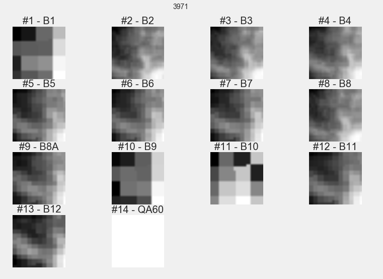

# Leak detection

*Michael Clark, Craig Baldachinno*

This project explores the idea that we can find leaks using satellite images and machine learning. The primary hypothesis is this: given the time and place of leak repairs and satellite images of 10-15m2 resolution we predict leaks better than a baseline defined by random guessing. Our results give and f1-score of around 0.6 compared to a dummy result of 0.5. This small result supports our hypothesis but the predictive capability is too small to be used for pipe maintenance. Our conclusion is that we can make small and uncertain predictions but with higher resolution data predictive capability may improve to useful amounts.

# Introduction

Water leakage in Western Australia account for more than 10 billion litres of water and costs over a billion dollars each year. The Water Corporation can only manually survey 10-12 percent of the pipe network each year for non-visible leaks. [[0]](https://www.watercorporation.com.au/-/media/files/about-us/our-performance/annual-report-2015/water-corporation-annual-report-2015.pdf). A solution that can detect leaks without additional on-site inspections would be valuable for water utilities around the world.

One solution is to use satellite images. Satellite derived vegetation indices can be used for the detection of water pipeline leakages in semiarid areas. [[1]](http://spie.org/Publications/Proceedings/Paper/10.1117/12.2028241). Spectral signiture profiles can also be used to detect leaks but the signitures can be complicated [[2]](http://proceedings.spiedigitallibrary.org/proceeding.aspx?articleid=1757291).

Deep learning has been successful at detecting objects from satellite images even when the images can give complicated response profiles [[3]](http://citeseerx.ist.psu.edu/viewdoc/download?doi=10.1.1.232.1679&rep=rep1&type=pdf). This project attempts to find leaks using satellite images - utilizing machine learning to overcome difficulties with compelex data.

# Data

We have a leak datasets, obtained by a freedom of information request to the very helpful people at Austin Water. Quality is hard to verify since little context is available. For example some entries could be meter repairs, false call-outs, typos, duplicates, or multi-stage repairs.

These have been combined with satellite image from Google Earth Engine to make machine learning datasets. For more see [the scraping notebooks](notebooks/scraped_satellite_images) and the readme files for each dataset. An example of this data is below:

Satellites only pass over once a week at best so not every leak has a corresponding image.

| dataset                     |  Satellite   |  Leak dataset  |  Resolution **  |
|-----------------------------|--------------|----------------|-----------------|
| s2-AUTX_v6_COPERNICUS-S2    |  [Sentinel 2](https://explorer.earthengine.google.com/#detail/COPERNICUS%2FS2)  |  ATX           |  >10m2          |
| l8-AUTX_v2_LANDSAT-LC8_L1T  |  [Landsat 8](https://explorer.earthengine.google.com/#detail/LANDSAT%2FLC8_L1T)   |  ATX           |  >15m2          |
| l7-AUTX_v2_LANDSAT-LE7_L1T  |  [Landsat 7](https://explorer.earthengine.google.com/#detail/LANDSAT%2FLE7_L1T)   |  ATX           |  >15m2          |
| s1-AURX_COPERNICUS-S1_GRD   |  [Sentinel 1](https://explorer.earthengine.google.com/#detail/COPERNICUS%2FS1_GRD)  |  ATX           |  >10m2          |

Notes:

\*	This data is combined from other rows in the table

**	This gives source resolution. All data was interpolated

What data filters yield the best results? To answer this question we used hyperparameter optimisation to find the data filters that have the most predictive power for each dataset. For more see the [hyperopt notebook](notebooks/3a_hyperopt.ipynb) and the data tables in the appendix.

# Models

Modelling and prediction is done in the [3_model notebook](notebooks/3_model.ipynb) where outputs include a map of false positives, predictions, and metrics. We tried many models and archetectures including U-Net (citation), pretrained VGG-16 (citation), decision-tree regressor, multi-layer perceptrons. No model gave any significant improvement over random forest methods so this was our primary benchmark.

# Results

Using a random forest model we tested 500 models on each of our satellite datasets. Dummy scores were generated by scikit's dummy classifiers with a uniform strategy. Since we are using balanced data we can use f1-scores as our primary benchmark. If max score doesn't exceed the dummy score then it's a dataset with lots of misleading features. The table below shows the results, for more see the [2_qc_scraped_data notebook](notebooks/2_qc_scraped_data.ipynb).

|                             |   support |   dummy_f1_leak |   f1_leak_max |   f1_leak_mean |
|:----------------------------|----------:|----------------:|--------------:|---------------:|
| s2-AUTX_COPERNICUS-S2       |       224 |            0.57 |          0.66 |          0.521 |
| l7-AUTX_LANDSAT-LE7_L1T     |      1082 |            0.54 |          0.66 |          0.426 |
| l8-AUTX_LANDSAT-LC8_L1T     |       434 |            0.55 |          0.69 |          0.55  |
| s1-AUTX_COPERNICUS-S1_GRD   |       281 |            0.58 |          0.68 |          0.511 |

Our results show that random forest can improve on dummy benchmarks. However the difference is small, and the f1-scores are low, implying to many false positives to be useful to water utility repair teams.

# Conclusion

The results support our hypothesis, that machine learning can use satellite images (of 10m2 resolution) to predict water leaks. However the f1-scores indicate predictions that are to unreliable to be used in the field.

 The largest limitation in this experiment was the resolution of satellite images. We expect better results with higher resolution images, unfortunately only a limited amout of high resolution imagery is available in 2017. Using the entire digital globe catalogue would yield around 20 matches with our leaks datasets, and the same goes for the high resolution US National Agriculture Imagery Program (NAIP).

# Appendix

## Files

The main files are
- `./notebooks/0_process_data` where the leak datasets are converted
- `./notebooks/scraped_satellite_images` where images are downloaded for each leak
- `notebooks/2_qc_scraped_data.ipynb` where test each dataset for consistency and predictive power
- `notebooks/2a_hyperopt.ipynb` where I try varied filters to see which has the most predictive power
- `./notebooks/2_model.ipynb` which is a jupyter-notebook script for python 3.

## Data filters

We have many options for filtering the data including balancing datasets, jittering value, augumenting data, and filtering out cloudy images. The most important parameter is "timespan_before", here we decide how long we will allow between a satellite image and a leak repair. If we choose to long we will have a image of a pipe before it started leaking, and if we choose to short a time we will reduce our dataset.

To solve this I ran hyperparamater optimisation where I tried all variations using a random forest model. The results are below. The results for Landsat-7 show that the best 50 models used a timespan_before of 1.13 days, before which images are discarded.

### best Landsat-7 filters

top 50 scores,

- by metric="result_metrics_report_f1-score_leak"
- for key="../output/hyperopt/data_filters_derived_l7_ATX.json"
- number of trials=564

|                                                 |    corr |    mean |     std | units   |
|:------------------------------------------------|--------:|--------:|--------:|:--------|
| misc_vals_balanced_classes                      |   0.118 |   0.98  |   0.141 | bool    |
| misc_vals_channel_shift_range                   |  -0.137 |   0.083 |   0.06  | frac    |
| misc_vals_height_shift_range                    |  -0.138 |   0.165 |   0.094 | frac    |
| misc_vals_max_cloud_cover                       |  -0.128 |   0.109 |   0.085 | frac    |
| misc_vals_normalized                            | nan     |   0     |   0     | bool    |
| misc_vals_rescale                               |  -0.011 |   0.33  |   0.089 | frac    |
| misc_vals_rotation_range                        |  -0.041 |   9.903 |   7.671 | deg     |
| misc_vals_timespan_before                       |  -0.24  |   1.134 |   1.181 | days    |
| misc_vals_width_shift_range                     |   0.027 |   0.271 |   0.091 | frac    |
| result_metrics_report_f1-score_leak             |   1     |   0.679 |   0.01  |         |
| result_dummy_metrics_report_dummy_f1-score_leak |   0.218 |   0.508 |   0.039 |         |
| result_dummy_metrics_report_dummy_support_leak  |  -0.259 | 217.64  | 207.412 | int     |

Here's how I interpret this table.

- balanced_classes: For the l7 datasets should we used balanced classes?
    - We have a decent positive correlation so it's important.
        - We had a mean of 0.98, but it's bool, so we should set it to True.

- channel_shift_range: How about channel shift range?
    - This has a decent negative correlation so it's important and having it too high gives a low f1 score.
    - The mean is 0.08+-0.06 so lets set it to 0.8.

### Best Landsat-8 filters

top 50 scores,

- by metric="result_metrics_report_f1-score_leak"
- for key="../output/hyperopt/data_filters_derived_l8_joined_ATX.json"
- number of trials=564

|                                                 |   corr |    mean |     std | units   |
|:------------------------------------------------|-------:|--------:|--------:|:--------|
| misc_vals_balanced_classes                      |  0.033 |   0.6   |   0.495 | bool    |
| misc_vals_channel_shift_range                   |  0.055 |   0.107 |   0.051 | frac    |
| misc_vals_height_shift_range                    | -0.04  |   0.22  |   0.147 | frac    |
| misc_vals_max_cloud_cover                       | -0.116 |   0.25  |   0.257 | frac    |
| misc_vals_normalized                            | -0.784 |   0.42  |   0.499 | bool    |
| misc_vals_rescale                               |  0.292 |   0.15  |   0.107 | frac    |
| misc_vals_rotation_range                        | -0.072 |  21.022 |   9.381 | deg     |
| misc_vals_timespan_before                       | -0.243 |   5.069 |   1.431 | days    |
| misc_vals_width_shift_range                     |  0.082 |   0.163 |   0.097 | frac    |
| result_metrics_report_f1-score_leak             |  1     |   0.633 |   0.027 |         |
| result_dummy_metrics_report_dummy_f1-score_leak |  0.006 |   0.495 |   0.026 |         |
| result_dummy_metrics_report_dummy_support_leak  | -0.235 | 411.2   | 173.273 | int     |

### Best Sentinel-2 filters

top 50 scores,

- by metric="result_metrics_report_f1-score_leak"
- for key="../output/hyperopt/derived_s2_joined_ATX.json"
- number of trials=1000

|                                                 |    mean |    std |   corr | units   |
|:------------------------------------------------|--------:|-------:|-------:|:--------|
| misc_vals_balanced_classes                      |   0.98  |  0.141 |  0.027 | bool    |
| misc_vals_channel_shift_range                   |   0.129 |  0.071 | -0.087 | frac    |
| misc_vals_height_shift_range                    |   0.35  |  0.134 |  0.008 | frac    |
| misc_vals_max_cloud_cover                       |   0.171 |  0.168 | -0.222 | frac    |
| misc_vals_normalized                            |   0.28  |  0.454 |  0.2   | bool    |
| misc_vals_rescale                               |   0.142 |  0.106 | -0.063 | frac    |
| misc_vals_rotation_range                        |  21.399 | 13.651 | -0.092 | deg     |
| misc_vals_timespan_before                       |   1.984 |  1.769 | -0.238 | days    |
| misc_vals_width_shift_range                     |   0.418 |  0.099 | -0.302 | frac    |
| result_metrics_report_f1-score_leak             |   0.684 |  0.021 |  1     |         |
| result_dummy_metrics_report_dummy_f1-score_leak |   0.505 |  0.061 |  0.105 |         |
| result_dummy_metrics_report_dummy_support_leak  | 113.68  | 88.334 | -0.35  | int     |

### Best Sentinel-1 filters

top 50 scores,

- by metric="result_metrics_report_f1-score_leak"
- for key="../output/hyperopt/data_filters_s1-AUTX_COPERNICUS-S1_GRD.json"
- number of trials=1000

|                                                 |    mean |     std |    corr | units   |
|:------------------------------------------------|--------:|--------:|--------:|:--------|
| misc_vals_balanced_classes                      |   1     |   0     | nan     | bool    |
| misc_vals_channel_shift_range                   |   0.169 |   0.06  |  -0.063 | frac    |
| misc_vals_height_shift_range                    |   0.167 |   0.115 |   0.146 | frac    |
| misc_vals_max_cloud_cover                       |   0.485 |   0.286 |  -0.121 | frac    |
| misc_vals_normalized                            |   0.06  |   0.24  |  -0.028 | bool    |
| misc_vals_rescale                               |   0.266 |   0.125 |  -0.105 | frac    |
| misc_vals_rotation_range                        |  19.203 |   9.334 |   0.232 | deg     |
| misc_vals_timespan_before                       |   2.099 |   1.21  |  -0.285 | days    |
| misc_vals_width_shift_range                     |   0.261 |   0.111 |   0.075 | frac    |
| result_metrics_report_f1-score_leak             |   0.668 |   0.014 |   1     |         |
| result_dummy_metrics_report_dummy_f1-score_leak |   0.508 |   0.04  |   0.093 |         |
| result_dummy_metrics_report_dummy_support_leak  | 165.88  | 100.096 |  -0.237 | int     |
